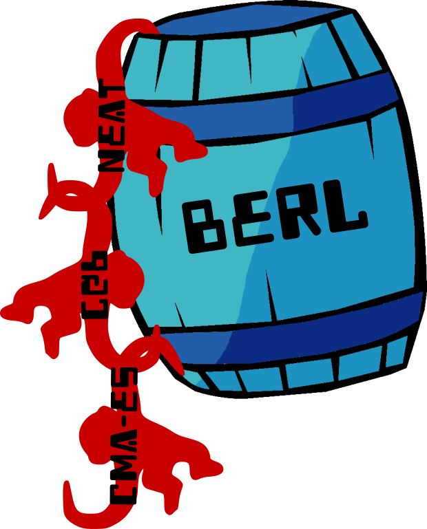

# BERL
Benchmarking Evolutionary Reinforcement Learning

A collaborative project for aggregating benchmarks of evolutionary algorithms on common reinforcement learning benchmarks.

Algorithms:
+ NEAT
+ HyperNEAT (2xfeedforward & recurrent ANNs)
+ CMA-ES (2xfeedforward & recurrent ANNs)
+ population-based REINFORCE
+ CGP
+ AGRN
+ TPG
+ grammatical evolution

Environments:
+ Gym classic control
+ mujoco
+ pybullet
+ mario

Fitness:
+ sum of reward over an episode
+ Novelty?
+ MAP-Elites
